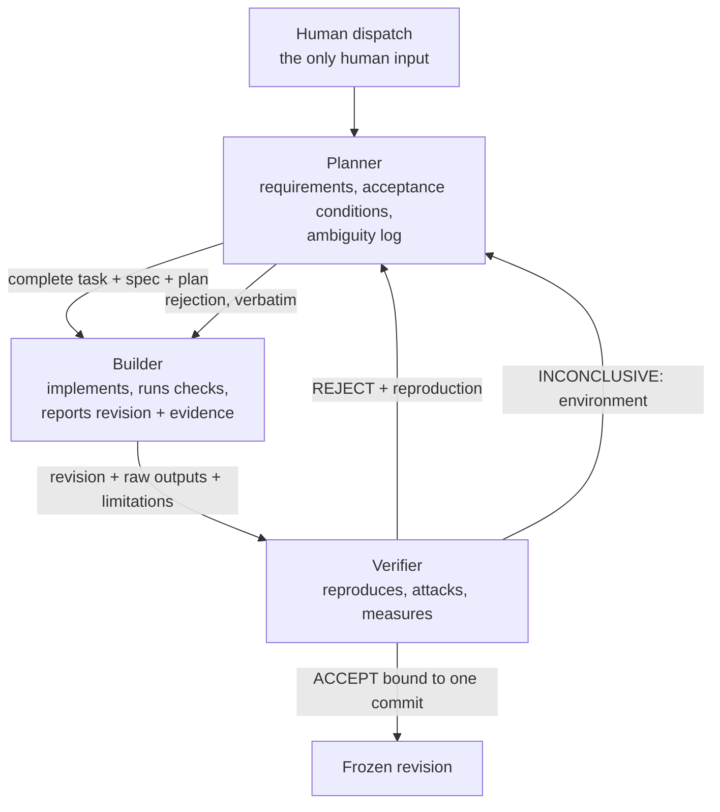
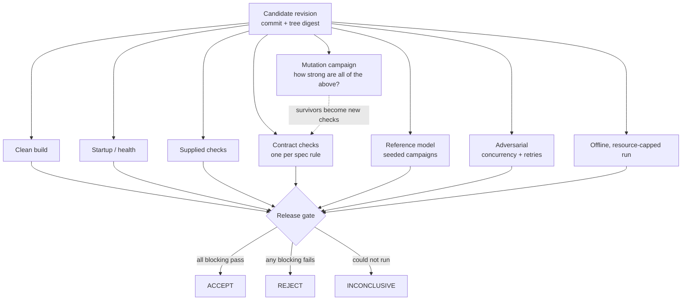
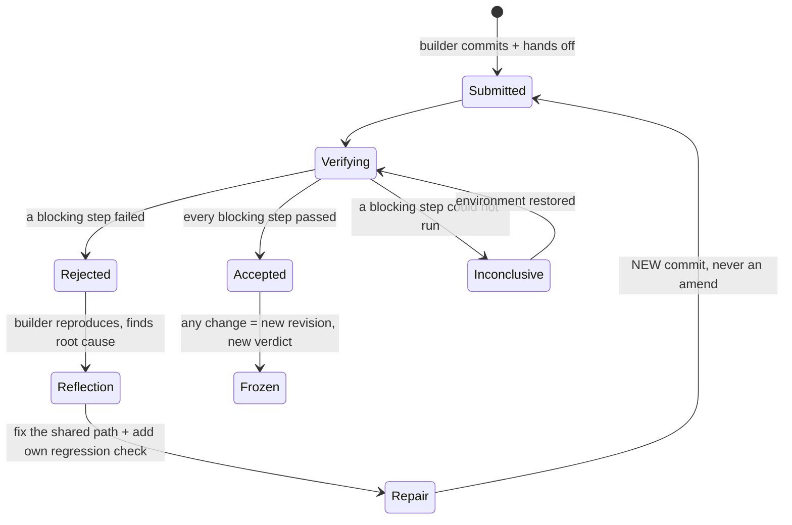

# FACTORY.md — how COMMIT works and how to stand it up

> **COMMIT does not ask whether an agent says its code works. It measures whether an
> independent factory can detect bad work, reproduce the failure, drive the repair, and
> independently verify the repaired revision.**

This document is meant to be enough, together with `mandates/`, for another team to
run this factory on a problem of their own. It covers the seats, how work moves
between them, the verifier's toolkit, how bad work is caught and repaired, what it all
costs, and what is not yet proven.

**Status, stated plainly.** The factory — mandates, protocol and toolkit — is complete
and has been exercised against a hand-written *calibration target* (a Pocketful stage-1
service) to measure the verifier's strength. **The judged BAND Desktop run has not
happened yet.** Every number below comes from an artifact in `evidence/`; anything that
needs the BAND run (token spend, seat-level costs, room evidence) is marked *not yet
measured* rather than estimated.

---

## 1. The seats

Three seats, each a coding agent in BAND Desktop with a standing mandate. No seat
accepts its own work.

| Seat | Handle | Owns | May not | Mandate |
|---|---|---|---|---|
| **Planner** | `@planner` | the plan, every handoff, the stage record, the final report | edit deliverable code; accept anything | [`mandates/planner.md`](mandates/planner.md) |
| **Builder** | `@builder` | the deliverable code and its own tests, inside its assigned folder | touch verification code; weaken a check; self-approve | [`mandates/builder.md`](mandates/builder.md) |
| **Verifier** | `@verifier` | the verdict, all verification code and evidence | edit deliverable code — even to fix a bug it found | [`mandates/verifier.md`](mandates/verifier.md) |



### Why three seats, and why this split

- **The producer must not be the evaluator.** A single agent that writes code, writes the
  tests, runs them and reports success produces a convincing report, not a verified
  artifact. The verifier is a separate seat with *no write authority over the
  deliverable*, so the only way a defect leaves the factory is past someone whose job is
  to find it.
- **The verifier must not repair.** If it fixed what it found and then approved its own
  fix, nobody independent would have checked the fix. Rejection goes back through the
  planner to the builder, every time.
- **The planner carries complete context.** BAND seats only see messages addressed to
  them; a handoff that says "see above" loses the task. The planner's main job is making
  every handoff self-contained, and keeping the requirement list both other seats work
  against.
- **Three is enough; a fourth would be a reviewer of style.** A separate "security" or
  "UX" seat would add handoffs without adding an independent *acceptance* decision.
  Those concerns are requirements in the plan and checks in the verifier's suite.

### Models

Each mandate starts with the harness and model its seat runs (`Harness:` / `Model:`
lines, which `harness check` reads) and a `Mandate-Version:`. The factory ships
**placeholders** for harness and model, because only the team configuring the seats knows
them; §2 step 2 fills them in. Running the verifier on a *different* model family from the
builder is a sound variation — it decorrelates the two seats' blind spots — and costs
nothing structurally.

---

## 2. Standing it up

### Prerequisites

| Tool | Why | Version |
|---|---|---|
| BAND Desktop | the room the seats work in | ≥ 0.4.10 |
| Docker daemon | clean-container and offline checks | any current |
| Node.js | the verifier toolkit (`commit/`) | ≥ 22.18 (type stripping on by default) |
| Python | only if your task ships a pytest harness | ≥ 3.12 |
| Git | revisions are the unit of acceptance | any |

The toolkit has **no npm dependencies**: `node commit/verify.ts` runs from a bare checkout.

### Steps

1. **Create the result repository and install the factory into it.**
   ```sh
   commit/bootstrap.sh --check /absolute/path/to/result-repo
   ```
   This copies `mandates/`, the `commit/` toolkit and this file — nothing else — and runs
   the installed toolkit's self-tests. It is safe to re-run: identical files are left
   alone, and a file you changed is reported as a conflict and left untouched unless you
   pass `--force`, which backs it up first. The band writes every deliverable itself.
2. **Fill in the seat facts.** Each mandate starts with
   `Harness: <fill in: …>` and `Model: <fill in: …>`. Replace both with what that seat
   really runs, exactly as BAND Desktop names it. The factory ships placeholders on
   purpose: these values cannot be known in advance, and a guessed value would be a false
   statement in the submission.
3. **Create three seats** in BAND Desktop named exactly **Planner**, **Builder** and
   **Verifier** (the mandate file names must match the seat names). Paste each mandate as
   the seat's standing instruction. Set each seat's working directory to the absolute
   path of the result repository. Give every seat Git and Docker permissions; the
   verifier's write permission is *by mandate* limited to `verification/` and `evidence/`,
   and `commit/verify.ts` independently detects any change to the candidate during a run.
4. **Confirm the room works**: add all three seats to one room and check that `@planner`,
   `@builder` and `@verifier` can each receive and answer a direct mention.
5. **Dispatch one task** to `@planner` (template below). That message is the only human
   input for the stage. Do not answer questions, approve or nudge until the planner's
   final report.
6. **Afterwards**: download the room as `room.json` (BAND console → Sessions → ⋮ →
   Download full session), commit it unchanged, write the result repository's README,
   and run the event's checks:
   ```sh
   python -m harness check <result-repo> --track <track>
   python -m harness run --track <track> --repo <result-repo> --all --mode isolated
   ```

### The dispatch message

```text
You are the lead seat. Run this task through the factory, one stage at a time.

Result repository (absolute path): <path>
Deliverable folder for this stage: <folder>
Specification: <paste the complete specification text here>
Delivery and runtime constraints: <paste them, e.g. how it is built, started and limited>
Checks supplied with the task, if any: <how to run them>
Earlier accepted stages that must keep working: <folders, or "none">

When the stage is accepted, copy the accepted folder forward for the next stage and
continue with the next specification: <paste, or "this is the last stage">.
```

Everything track- or product-specific goes here, in the task. The mandates never change
between problems — that is what makes the factory reusable.

---

## 3. The handoff protocol

Every handoff names one commit and carries the full content it depends on; "see above",
"tests passed" and "looks good" are not evidence.

**Planner → Builder** — the complete task and specification text, `plan/stage-<n>.md`
(numbered requirements `R-nn`, each with an acceptance condition, the evidence that would
show it, edge cases, an ambiguity log with the conservative choice made), the repository
path, the folder, the constraints, the checks.

**Builder → Verifier** (via the planner):

```text
Work completed:       R-01 … R-nn
Revision:             <full commit hash>
Folder / files changed
Commands executed:    <exact>
Actual outputs:       <verbatim>
Checks passed/failed: <numbers>
Limitations:          <everything missing, partial or assumed>
Reproduction:         <from a clean checkout>
```

**Verifier → everyone** — a verdict bound to that commit:

```text
REJECT                                      ACCEPT
Revision:          <commit>                 Revision:                      <commit>
Failure class:     <kind of defect>         Checks independently executed: <list, counts>
Requirement:       <R-nn>                   Results:                       <numbers>
Observed:          <verbatim>               Mutation kill rate:            <measured>
Expected:          <from the spec>          Limitations:                   <not verified>
Reproduction:      <exact command>          Production modification by verifier: NONE
Seed:              <if generated>
Evidence:          <file + digest>
Production modification by verifier: NONE
Next action:       Builder repairs and resubmits.
```

`commit/verify.ts` writes exactly these blocks (`verdict.md`) from executed steps, so a
verdict cannot be typed without the run behind it.

---

## 4. The verifier's toolkit (`commit/`)

All generic: none of it knows what the service under test does. The problem-specific
parts — the reference model, the adversarial campaigns, the contract checks — are
written by the verifier seat *during the run, from the specification*, and plug into
these runners.

One entry point, `node commit/cli.ts <command>` (every command takes `--help`):

| Command | What it does |
|---|---|
| `verify --plan P --out D [--revision SHA]` | Runs a verification plan against one candidate revision. Records commit, branch, dirty state and a tree digest; starts the service from a throwaway copy; runs every step under a time budget; classifies each step; writes the evidence manifest (schema v2) and its sha256, `verdict.md`, `scorecard.md`, `reproduction.sh`. Re-digests the candidate afterwards — **if it changed, the verdict is ERROR**. |
| `campaign --module M --seed S --operations N` | Seeded reference-model campaign: a small model and the live service driven by the same generated operations, every reply and the whole observable state compared, stop at the first divergence. The report records the seed, the module's sha256 and the exact reproduction command. |
| `mutate --target T --start S --check C` | Mutation campaign in isolated copies. Aborts with no score if the unmutated baseline fails or a check cannot run. Reports killed / survived / timeout / invalid / error / equivalent, which verification layer caught each kill, and a `--only <id>` replay command. |
| `audit <evidence dir>…` | Evidence consistency: manifest hash, log and report hashes, `verdict.md` and `scorecard.md` against the manifest, mutation numbers against the report. |
| `doctor` | What this machine can run: Node version, git, Docker *daemon* reachability (not just the binary), Python, the kickoff package. |
| `bootstrap.sh [--check] [--force] <repo>` | Installs the factory into a result repository (§2). |

### Verdicts and exit codes

| Verdict | When | Exit |
|---|---|---|
| **ACCEPT** | every blocking step ran and passed, on a clean, identified git revision | 0 |
| **REJECT** | a blocking step failed or timed out; a step's report contradicts its exit status; the candidate did not start | 1 |
| **INCONCLUSIVE** | nothing failed, but required evidence is missing: a step blocked by the environment or skipped, no blocking step ran at all, an unidentified revision, uncommitted changes in the candidate | 3 |
| **ERROR** | the verification itself is untrustworthy: the candidate changed during the run, a step could not be executed, a declared report is missing or malformed | 4 |

Precedence is ERROR > REJECT > INCONCLUSIVE > ACCEPT, and every reason is listed in the
manifest's `verdictReasons`. Usage, configuration and input errors exit 2 before any
evidence is written; an interrupted run exits 130 and is marked `CANCELLED` in
`run-state.json` with **no verdict written**. Each step's status is one of `PASSED`,
`FAILED`, `TIMEOUT`, `ERROR`, `BLOCKED` (environment) or `SKIPPED`.

### Evidence contract

```text
evidence/<run>/
  run-state.json     RUNNING → COMPLETED, or CANCELLED; updated after every step
  evidence.json      schema v2: runId, factoryVersion, stage, specification, plan,
                     revision {commit, branch, targetDirty, targetDigest, …After},
                     environment {node, git, docker {installed, daemonReachable}, …},
                     steps[] {id, status, reason, exitCode, durationMs, outputBytes,
                     outputTruncated, redactions, log, logSha256}, reports, artifacts[]
                     {path, type, producer, sha256}, verdict, verdictReasons
  evidence.sha256    integrity identifier of evidence.json (not proof of correctness)
  verdict.md         generated from evidence.json
  scorecard.md       generated from evidence.json; "not measured" where nothing was run
  reproduction.sh    checks out the revision and re-runs the plan
  logs/<step>.log    full output (bounded, redacted); <step>/ reports written by steps
```

Every JSON artifact is validated: plans before anything runs, step reports against
their kind (a mutation report's tally must add up; a reference report must have run at
least one operation; any report stating `failed` counts must agree with the exit code),
the equivalent-mutant register against the current source (a stale id stops the
campaign), and the manifest against its own schema before it is written. All artifacts
are written atomically (temporary file, fsync, rename), so a crash leaves either the
previous file or the complete new one.

### Security model

| Risk | Control |
|---|---|
| Command injection | Child processes take argument vectors. Plan commands are shell by design — a plan is code the verifier writes — and the only values the toolkit substitutes into them (`{out}`, `{url}`, `{kickoff}`) are POSIX-quoted; a test proves `--out 'x; touch PWNED $(…)'` runs nothing. |
| Path escape | Plan targets and report paths must be relative and free of `..`; `mutate --files` may not leave the target; bootstrap refuses `/` and the factory itself. |
| Credentials in public evidence | Every step log passes through redaction (bearer tokens, `sk-` keys, AWS and GitHub tokens, values assigned to variables named like `*_KEY`, `*_TOKEN`, `*_SECRET` or `*_PASSWORD`, URL passwords, private keys) before it is hashed; the self-audit scans all factory files and evidence for the event scanner's credential shapes. |
| Runaway processes | Every child has a time budget, runs in its own process group and is stopped with SIGTERM then SIGKILL; on SIGINT/SIGTERM all children stop and temporary workspaces are removed. |
| Unbounded output | Output streams to disk up to `COMMIT_MAX_LOG_BYTES`; the rest is counted and the truncation recorded, never silent. |
| Verifier editing the candidate | Services run from a copy; the candidate tree is digested before and after; any change voids the run. This is detection, not prevention: on one machine the verifier seat *can* write the files, and its mandate is what forbids it. |
| Ambiguous provenance | Acceptance requires a clean, identified commit; `--revision` refuses to run against any other HEAD. |

### Configuration

All tunables are `COMMIT_*` environment variables, validated at start (a bad value exits
2 with `CONFIG_ERROR`): `COMMIT_STEP_TIMEOUT_MS` (default 10 min),
`COMMIT_SERVICE_START_TIMEOUT_MS` (60 s), `COMMIT_MUTANT_TIMEOUT_MS` (3 min),
`COMMIT_MAX_LOG_BYTES` (32 MiB), `COMMIT_KILL_GRACE_MS` (2 s), `COMMIT_KICKOFF`
(the event kickoff checkout a plan refers to as `{kickoff}`). Nothing secret has a
default.

Details of each layer, the mutation operators and the report formats are in
[`docs/factory/verification.md`](docs/factory/verification.md).

### The verification pipeline



### Failure classes

| Class | Meaning | Verdict |
|---|---|---|
| Implementation failure | the candidate is wrong | REJECT, with reproduction |
| Environment failure | the check could not run here (no Docker daemon, missing tool) | INCONCLUSIVE — never ACCEPT, never REJECT |
| Verification failure | the verifier's own check was wrong | fix the check, re-run, say so |
| Candidate modified | the tree digest moved during verification | ERROR — the run is void |

---

## 5. Reject → repair → re-verify



Rules: the verifier never patches; the builder never argues a rejection away by editing
a check; every repair is a new commit; after five rejections of one requirement the
planner records a blocker instead of looping.

**Rehearsed with real revisions.** [`evidence/calibration/stage-1/repair-loop/`](evidence/calibration/stage-1/repair-loop/)
holds a scripted rehearsal on the calibration target: a deliberately faulty revision,
the verifier's REJECT with its reproduction, the repair commit, and the re-verification.
Both revisions are real commits on the branch `rehearsal/repair-loop`; `main` carries only
their evidence. **Correction:** commit `6020598` was made with `git commit -a` and so also
swept in two unrelated working-tree changes — a README rewrite and a one-line bootstrap
fix. The verdicts are unaffected (the verifier digests only `calibration/pocketful-stage-1/`,
which differs from its parent by exactly the deliberate defect), but the commit is less
clean than intended, and the README rewrite never reached `main` until it was redone.
The branch is left as it is rather than rewritten. It is a rehearsal of the *mechanism* with one person playing builder,
not evidence of seat autonomy — that comes from the BAND run.

| | Revision | What it is | Verdict |
|---|---|---|---|
| 0 | — | prediction, written before the faulty revision existed: shipped, contract and reference checks pass; adversarial same-key campaigns fail ([`0-prediction.md`](evidence/calibration/stage-1/repair-loop/0-prediction.md); written to a scratch file at 15:49 UTC, committed with the evidence afterwards) | — |
| 1 | `6020598` | an audit-log write awaited between the idempotency-key lookup and the claim | **REJECT** — shipped checks 147/147 pass, contract and all three reference campaigns pass; adversarial fails: **up to 24 payments committed under one key** in a 50-request burst ([verdict](evidence/calibration/stage-1/repair-loop/1-faulty-revision/verdict.md)) |
| 2 | `57e088b` | repair: lookup, operation and claim in one synchronous step; audit after the claim | **INCONCLUSIVE** — every runnable step passes, adversarial 55/55 rounds; not ACCEPT because mutation was skipped for this gate run and Docker could not run here ([verdict](evidence/calibration/stage-1/repair-loop/2-repaired-revision/verdict.md)) |

The point of the rehearsal: the defect is invisible to every sequential check —
including the 147 checks shipped with the task — and is caught only because the verifier
attacks with concurrent requests and judges the resulting state. A factory whose
acceptance rested on the supplied checks would have shipped a double-spend.

---

## 6. Measured results — verifier calibration

The calibration target is a Pocketful stage-1 service written by hand to the published
specification (`calibration/pocketful-stage-1/`). It exists to answer one question
before any judged run: **how much bad work does this verifier actually catch?** It is
not a submission stage and is never copied into one.

### Latest independent verification: `a899d17` — **ACCEPT**

[`evidence/calibration/stage-1/run-20261002T072952Z/`](evidence/calibration/stage-1/run-20261002T072952Z/) — [`verdict.md`](evidence/calibration/stage-1/run-20261002T072952Z/verdict.md), [`scorecard.md`](evidence/calibration/stage-1/run-20261002T072952Z/scorecard.md),
evidence schema v2, manifest sha256 `4b2e99cfbc8f21ebb593bf99e46a358c7f955cca28222263a3d0856a870e7741`, run 2026-10-02 07:29–08:08 UTC,
Node v26.5.0, Docker 29.6.2, clean revision. Audits clean, also in a fresh clone.

| Layer | Result |
|---|---|
| Typecheck, lint | PASSED |
| Startup / health | PASSED |
| Clean container build (`docker build --no-cache`) | PASSED |
| Official isolated-mode harness (internal network, **no outbound access**, 2 vCPU, 2 GiB) | PASSED — stage 1 **147 / 147**, stage 2 0 / 35 (must fail), highest contiguous stage 1; judged from the harness's `report.json` |
| Shipped stage-1 checks (official kickoff package, host) | **147 / 147** |
| Overshoot probe (stage-1 must *not* pass the stage-2 suite) | PASSED — the stage-2 hold check ran and failed (pytest exit 1). Vacuous in runs before rc.2 (§8) |
| Contract checks (one per spec rule, incl. import-corruption fuzz) | **248 / 248** |
| Reference model, seeds 481927 · 7 · 90210 | **agree** — 3 × 1,000 generated operations, 6,300 invariant checks, no divergence |
| Adversarial campaigns | **55 / 55** rounds (11 campaigns × 5 seeds), 225 state checks, 50 concurrent requests per burst |
| Mutation campaign #6 | **398 killed / 417 valid = 95.4%** (see below) |
| **Verdict** | **ACCEPT** — every blocking step ran and passed |

Earlier full runs, all with the same mutation numbers:
[`run-20261002T052447Z`](evidence/calibration/stage-1/run-20261002T052447Z/) (`80f7caa`,
**REJECT — a verification failure**: the isolated harness passed but was judged by its
exit code, §8), [`run-20261002T033320Z`](evidence/calibration/stage-1/run-20261002T033320Z/)
(`bcc73e9`, INCONCLUSIVE: no Docker daemon),
[`run-20261002T024548Z-d4b9f5`](evidence/calibration/stage-1/run-20261002T024548Z-d4b9f5/)
and [`run-20261001T163312Z`](evidence/calibration/stage-1/run-20261001T163312Z/)
(INCONCLUSIVE, vacuous overshoot probe).

### What the mutation campaigns measured

The kill check is the verifier's whole suite against each mutant. Between campaigns the
*suite* was strengthened from what the survivors showed; the service changed only where
a new check found a real defect.

| Campaign | Kill check | Valid | Killed | Survived | Kill rate | Raw rate¹ | Evidence |
|---|---|---|---|---|---|---|---|
| #1 | shipped + reference + adversarial | 469 | 300 | 168 | 64.0% | 64.0% | [`mutation-run-1`](evidence/calibration/stage-1/mutation-run-1/mutation-report.md) |
| #2 | + contract checks, import fuzz, signup race | 467 | 372 | 94 | 79.7% | 79.7% | [`mutation-run-2`](evidence/calibration/stage-1/mutation-run-2/mutation-report.md) |
| #3 | + checks for #2's observable survivors; 58 equivalents excluded | 417 | 398 | 18 | **95.4%** | **83.8%** | [`run-20261001…/mutation`](evidence/calibration/stage-1/run-20261001T163312Z/mutation/mutation-report.md) |
| #4 | same suite, rewritten engine (factory 1.0.0-rc.1), validated register | 417 | 398 | 18 | **95.4%** | **83.8%** | [`run-20261002…/mutation`](evidence/calibration/stage-1/run-20261002T024548Z-d4b9f5/mutation/mutation-report.md) |
| #5 | same suite, factory 1.0.0-rc.2 | 417 | 398 | 18 | **95.4%** | **83.8%** | [`run-20261002T0333…/mutation`](evidence/calibration/stage-1/run-20261002T033320Z/mutation/mutation-report.md) |
| #6 | same suite; the ACCEPTED run | 417 | 398 | 18 | **95.4%** | **83.8%** | [`run-20261002T0729…/mutation`](evidence/calibration/stage-1/run-20261002T072952Z/mutation/mutation-report.md) |

¹ Counting the 58 excluded equivalents as survivors — the like-for-like comparison with #1
and #2. Campaigns #4, #5 and #6 reproduced #3 exactly — same kills, same survivors, same per-layer
counts — after the mutation engine, process runner and report format were rewritten: the
measurement does not depend on the incidental details of the tool that took it. Each campaign also had 8 invalid mutants (never started) and 1 timeout.

**Which layer caught what (campaigns #3–#6, identical).** Killed by each layer, and killed by that layer
*alone* — defects every other layer would have accepted:

| Layer | Killed | Alone |
|---|---|---|
| Shipped checks | 282 | 3 |
| Contract checks | 388 | 97 |
| Reference model | 235 | 1 |
| Adversarial | 145 | 1 |

97 of the 398 kills — a quarter — would have shipped with the task's own checks plus the
reference model and adversarial campaigns. That is the gap a verifier that stops at "the
supplied checks pass" leaves open.

**The 18 survivors are not hidden.** They are listed in the report and are real gaps,
not excluded: a request-size guard nothing tests (8), a tampered password hash inside an
imported state (4), the default port 8080 when `PORT` is unset (1), fixture-id and amount
boundary logic (4), a one-character seeded password (1).

**Defects the verifier found in the calibration service itself** (beyond mutants):
an imported state with a duplicated payment or request was accepted instead of rejected
(§10) — found by the import-corruption fuzz, fixed in `6a1dc58`; and an index that was
written but never read — found by a surviving mutant, removed in `ae805bc`.

---

## 7. What it costs

Measured on one 12-core, 15 GB Linux machine (Node 26), from the reports' own timings.

| Activity | Wall time |
|---|---|
| Shipped stage-1 checks | 19–20 s |
| Contract checks (248) | 2.8 s |
| One reference campaign, 1,000 operations | 4.5–5.3 s |
| Adversarial campaigns, 5 rounds × 11 | ~10 s |
| Release gate (`verify --skip mutation`) per revision | ~50 s |
| Kill suite against one candidate | ~26 s |
| Mutation campaign, ~480 mutants, 6 parallel jobs | 31.4–37.3 min |
| Full verification including mutation | 32.2 min (#3), 32.2 min (#4), 30.9 min (#5), 38.6 min (#6, with both container steps) |
| Clean container build | 3–9 s (no npm install step) |
| Official isolated-mode harness run | 23.7 min cold (builds its runner image once), 6.2 min warm |
| Factory self-audit (`pnpm verify`) | 81 s |
| Factory self-tests (37) | 23 s, most of it the mutation-engine test |

The design consequence: the **release gate** (under a minute) runs on every revision;
the **mutation campaign** runs when a stage is about to be accepted, and whenever the
suite changes, because its job is to measure the suite rather than the revision.

Token and model spend per seat can only be measured in a BAND run; they are recorded in
`plan/stage-<n>.md` by the planner during the run and are **not yet measured** here.

---

## 8. What we tried that failed, and what it taught the factory

Each of these happened while building and calibrating the factory; each changed it.

| What happened | What it showed | What changed |
|---|---|---|
| Mutation campaign #1 killed only **64.0%** of valid mutants, though every layer was green | A green suite was blind to whole rule families: signup validation, length limits, import of corrupted state, unknown routes, paging edges, concurrent duplicate signups | A contract layer (one check per spec rule) and an import-corruption fuzz; a `signup-race` campaign; campaign #2 measures the difference |
| A surviving mutant deleted an index update and nothing noticed | The index was written but never read — dead state | Removed. Mutation testing finds unused code as well as missing checks |
| Two new contract checks failed against the known-good service | Both were **verifier bugs**: a default parameter silently re-supplied a key the check meant to omit; an assertion matched unrelated feed items | The *verification failure* class exists for this; the checks were fixed, the service was not touched |
| The mutation lexer's `[+-=]` was a character *range* (`+` to `=`, including digits) | It would have silently skipped arithmetic mutants such as `a-1` — a quietly weaker campaign, not a crash | Fixed; `commit/lib/mutants.test.ts` pins it |
| `verify.ts` substituted `{url}` in every step, including the mutation step whose `{url}` belongs to each mutant | Generic tools composing generic tools need explicit placeholder ownership | `{url}` is filled only for steps that declare `needsService` |
| Editing the verification scripts while a campaign ran would have changed the check halfway through a measurement | A measurement is only valid if its inputs are frozen for its duration | Campaign inputs are frozen until the run finishes; each run is committed with its own evidence directory, and `verify.ts` refuses a non-empty output directory |
| The upstream ledger this repository started from matched none of the Pocketful API, and its dev database URLs trip the event's credential scanner | Reuse has to survive the specification and the rules, not only the code review | The ledger stays for provenance and is never copied into a submission (README, Provenance) |
| The docs promised Node ≥ 22.18, but the campaign runner used `import.meta.main`, a newer API | A version claim is a claim like any other: it needs a run behind it | Replaced with a portable check; the toolkit self-tests, the calibration service (248/248 contract checks) and a reference campaign were then run on a real Node 22.18.0 binary |
| A first test of the mutation engine took 180 s: a mutant that deletes the response leaves the check's HTTP request hanging until the 3-minute mutant budget | The engine was right (a hang is classified `timeout`, never a kill), but checks need their own request timeouts, and budgets must be configurable | `--timeout` and `COMMIT_MUTANT_TIMEOUT_MS`; the test now pins the hang to `timeout` in 20 s |
| The evidence auditor detected "am I the main program?" with a filename suffix test, and `self-audit.ts` also ends in `audit.ts` | Suffix tests on paths are wrong; the self-audit's first run printed the auditor's usage and stopped | Exact path comparison, as in the campaign runner |
| The full self-audit flagged `commit/self-audit.ts` for naming the track | It was right: that script hard-codes this repository's calibration plan, so it is not generic, and bootstrap would have installed it into result repositories where it cannot work | Moved to `scripts/self-audit.ts`; `commit/` stays installable anywhere |
| An earlier summary said the README had been rewritten; it had not reached `main` (see §5) | A claim about the repository needs the same check as a claim about the software | The README was rewritten on `main`; the self-audit now covers the documents' file paths and secrets, and the release checklist includes reading the committed files |
| Tests that print fake credentials would have shipped credential shapes into every result repository, where the event's scanner fails the submission | Test fixtures are files too | Fixture secrets are assembled at run time; the self-audit runs the credential scan over every factory file |
| The root `.gitignore`'s `*.log` rule silently excluded every step log under `evidence/`: each committed manifest referenced logs, with their sha256, that a clone never received | The self-audit checked the working tree, where the ignored files exist; a judge receives a clone, where they do not | Logs committed byte-identical; `!evidence/**/*.log` in this repository and in the result repositories bootstrap creates; the self-audit now audits a fresh clone of HEAD |
| The overshoot probe ("the stage-1 service must not pass the stage-2 suite") was `! pytest …`, and pytest was failing at collection (`ModuleNotFoundError: playwright`) — so every run's "overshoot: pass" meant only "pytest crashed" | Negating an exit code turns *any* failure, including a broken harness, into success: the exact "missing evidence → assume pass" pattern the toolkit forbids elsewhere | The probe runs one API-only stage-2 check, requires pytest exit 1 (ran and failed), and is BLOCKED when its tools are missing; runs before 1.0.0-rc.2 are annotated |
| With Docker available, the verifier REJECTED its own known-good candidate: the official isolated-mode harness passed stage 1 147/147, but exits with the worst status of all its suites — including the next stage's, which a correct stage-1 folder must fail | An exit code is only evidence if you know what it encodes. A by-hand run had "exited 0" only because its output was piped into `tail`, which masked the harness's status | A *verification failure*, handled as the mandate says: the check was fixed (`isolated-check.ts` judges `report.json`), the service untouched, and the wrong REJECT kept as evidence (`run-20261002T052447Z`) |
| The isolated harness writes its own logs and reports into the evidence directory, bypassing step-log redaction, so they carried the local home path | Redaction must apply to everything that lands in public evidence, not only to what the verifier itself writes | `verify.ts` scrubs every file under the evidence directory before hashing; the two affected runs' harness files were scrubbed afterwards (they are not hash-covered), disclosed in the commit |
| No Docker daemon could be started on the calibration machine (no root) | A verifier that turned "could not run" into "pass" or "fail" would lie either way | `INCONCLUSIVE` is a first-class verdict: a blocking step that could not run blocks acceptance without blaming the implementation |

---

## 9. Known limitations

- **No judged BAND run yet.** Agent-teamwork evidence (room log, seat-attributed commits,
  token costs) does not exist until the factory is run in BAND Desktop as described in §2.
- **The calibration target was written by hand**, so its verification measures the
  *verifier*, not the band's ability to build. Under the event rules hand-built code does
  not count toward a stage.
- **Mutation operators are syntactic** (JavaScript/TypeScript only). They model realistic
  slips — boundaries, guards, dropped state updates — but not design-level defects such as
  a missing feature, and a high kill rate does not imply correctness.
- **Equivalent mutants are classified by a reviewer**, with a written reason per mutant in
  `calibration/verification/equivalents.json`; the classification is a judgement, shown in
  full so it can be challenged.
- **The reference model shares an author with the calibration service.** Its
  independence is structural — separate code, its own arithmetic and derivations — not
  authorial. In the BAND run the verifier seat writes the model without reading the
  builder's code.
- **Container behaviour is verified for the calibration target only.** The clean build and
  the official isolated-mode run passed (§6); a band-built stage folder must pass the same
  steps in its own verification. `pnpm doctor` shows whether a machine can run them.
- **The verifier's independence is detected, not enforced by the operating system.** All
  seats run as the same user on one machine; the digest check voids any run in which the
  candidate changed, and the mandate forbids the verifier to edit it, but nothing stops a
  write in the first place. Running the verifier in its own Docker Sandbox with a
  read-only mount of the deliverable would enforce it.
- **Concurrency outcomes are not replayable from a seed.** A seed fixes each adversarial
  campaign's fixture and burst; the interleaving of 50 concurrent requests is up to the
  scheduler. A failing round prints its seed and a one-round reproduction command, which
  reproduces the attack, not necessarily the exact interleaving.
- **Interrupted runs are resumable only by re-running.** `run-state.json` distinguishes
  `CANCELLED` and `RUNNING` from `COMPLETED`, and an interrupted run never writes a
  verdict, but there is no step-level resume.
