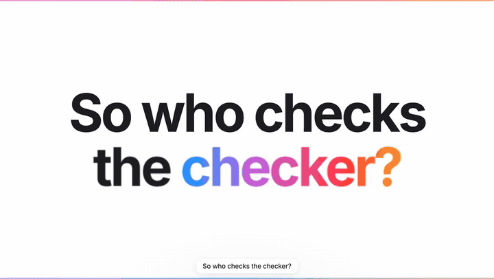
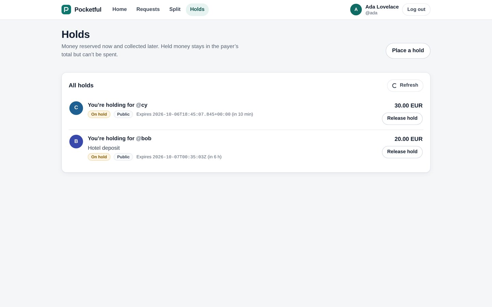
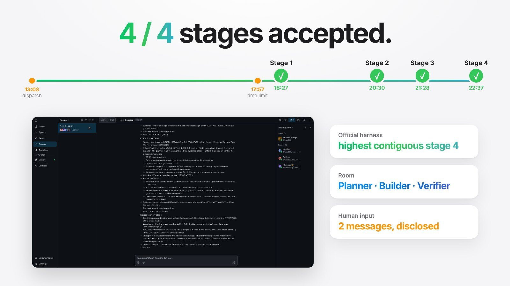
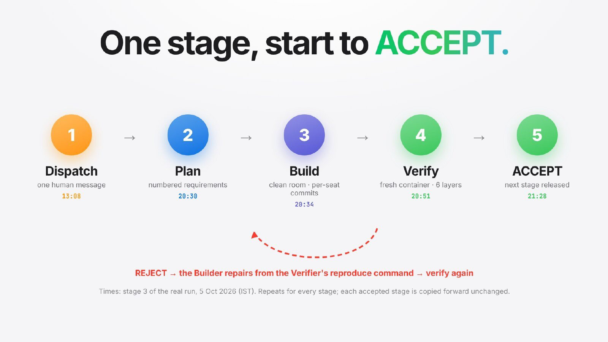

# COMMIT × Pocketful — BAND result repository

**Track:** pocketful · **Factory:** [COMMIT](https://github.com/Aaditya1273/COMMIT) v1.0.0-rc.3 · **Run:** 5 Oct 2026, 13:08 → 22:40 IST

Every line under `stage-N/` was written by three Claude Code seats (Planner, Builder, Verifier;
model `claude-opus-5-5`) working together in one BAND Desktop room. Nothing in a stage folder was
written or edited by a human. `room.json` is the unedited full-session download of that room.

<p align="center">
  <a href="https://lablab.ai/ai-hackathons/wearedevelopers-hackathon/guerrero/commit-factory-that-measures-bad-work"></a>
</p>

<p align="center">
  <a href="https://lablab.ai/ai-hackathons/wearedevelopers-hackathon/guerrero/commit-factory-that-measures-bad-work"><b>▶ Watch the film (3:53)</b></a> &nbsp;·&nbsp;
  <a href="https://storage.googleapis.com/lablab-static-eu/submissions/ajdxs9xxz0t764xhuqddyv99/mmgki45xibk6ufrn0r8gevx0/presentation/presentation_benph46sw7dnougxvgfjj7qa.pdf"><b>Presentation (PDF)</b></a> &nbsp;·&nbsp;
  <a href="https://github.com/Aaditya1273/COMMIT"><b>The factory (COMMIT)</b></a> &nbsp;·&nbsp;
  <a href="https://lablab.ai/ai-hackathons/wearedevelopers-hackathon/guerrero/commit-factory-that-measures-bad-work"><b>Hackathon submission</b></a>
</p>

## Result

| Stage | Verdict | Accepted revision | Official checks (isolated, no network) | Verifier's independent evidence | Time |
|---|---|---|---|---|---|
| 1 | **ACCEPT** | `29baf05` | suite 1 **147/147** · suite 2 fails as required | 14/14 blocking steps · contract 49/49 · reference 3×1000 ops, 24,000 invariant checks · adversarial 50/50 · **full mutation campaign 92.5 % (653/706)** | 5 h 19 min |
| 2 | **ACCEPT** | `ef962af` | suites 1/2 **147/147 · 35/35** · suite 3 fails as required | 19/19 blocking steps · UI 16/16 · auth contract 14/14 · upgrade 10/10 · adversarial 25/25 + 50/50 · mutation sample 79.8 % | 2 h 03 min |
| 3 | **ACCEPT** | `39de1bf` | suites 1/2/3 **147/35/6** · suite 4 fails as required | 24/24 blocking steps · upgrade 58/58 · ledger contract 12/12 · reference ledger 3×1000 · adversarial 20/20 · mutation sample 86.0 % | 58 min |
| 4 | **ACCEPT** | `cc1d710` | suites 1/2/3/4 **147/35/6/5** | 25/25 blocking steps · refund contract 5/5 · upgrades 58/58 + 19/19 · regression and reference agree · mutation sample 77.0 % | 1 h 09 min |

Highest contiguous stage reproduced by the official harness on this repository: **stage 4 — every folder claims its own stage (share 1.0)**
(`python -m harness run --track pocketful --repo . --all --mode isolated`, report in `evidence/final-harness/`).

Every verdict is in `evidence/stage-N/run-*/verdict.md` with an `evidence.json` manifest sealed by
sha256 and a `reproduction.sh`. Re-check any of them from a fresh clone:

```sh
node commit/cli.ts audit evidence/stage-*/run-*
```

## What the factory built

Pocketful — a wallet with payments, requests, splits, holds, a revisioned ledger, statements,
corrections and refunds — written entirely in the BAND room. Screenshots of the accepted
stage-4 revision (`cc1d710`), running locally with the band's own UI:

<p align="center"> </p>
<p align="center"> </p>

Run it: `cd stage-4 && docker build -t pocketful . && docker run --rm -p 8080:8080 pocketful`,
seed with `POST /_test/reset`, then open <http://localhost:8080/login> (see [`stage-4/RUN.md`](stage-4/RUN.md)).

## The run, at a glance

<p align="center"> </p>
<p align="center"> </p>

## How the work was shared

The room log and the commit history show the split; each commit is authored by its seat.

| Seat | Turns | Output tokens | Cache-write | Cache-read |
|---|---|---|---|---|
| Planner | 150 | 184,172 | 793,570 | 20,238,127 |
| Builder | 335 | 871,163 | 2,411,045 | 97,241,422 |
| Verifier | 536 | 1,175,435 | 3,097,248 | 189,677,513 |
| **Total** | **1021** | **2,230,770** | **6,301,863** | **307,157,062** |

The Planner wrote each stage's numbered requirements, acceptance conditions and ambiguity log,
handed the complete specification to the Builder in parts, and released the next stage only after
an ACCEPT. The Builder wrote each stage in a clean room, copying the previously accepted stage
forward unchanged before extending it. The Verifier never modified production code: it rebuilt each
candidate in a fresh container with no network, ran the official checks, then its own contract,
reference-model, adversarial and mutation layers, and decided.

Stage 1 shows the factory measuring itself: the first mutation campaign left 239 mutants alive, the
Verifier wrote new checks for them (a survivors layer, boundary and round-trip checks), fixed two
bugs in its own verification code, replayed the survivors (91 more killed, including all 6 hang
mutants) and registered the remaining equivalents with a disposition each before accepting.

## Human input — disclosed

Two human messages were posted in the room, both shown in the film and in `room.json`:

1. **13:08 IST — the dispatch** (all four stages; `DISPATCH` text in the room).
2. **17:57 IST — a time limit:** finish by 23:00 IST; from stage 2 on, run the mutation step as a
   seeded 100-mutant sample (`commit mutate --max 100 --seed 1`) instead of the full campaign; every
   other gate step unchanged. The reason was the submitter's schedule (the deadline fell during
   classes), not a problem in the run. No approvals, hints, debugging or reruns were given.

Stages 2–4 therefore report a *sampled* kill rate; stage 1 ran the complete 782-mutant campaign.

## Cost

Wall-clock: 13:08 → 22:40 IST (9 h 32 min) for all four stages; stage 1 alone took 5 h 19 min because it ran the full 782-mutant campaign. Times in the table run from the previous ACCEPT (or the dispatch) to the stage's ACCEPT. Token usage per seat is in the table above, read
from each seat's own Claude Code session transcript (summed from the `usage` field of every assistant turn; input tokens are tiny because almost everything is served from the prompt cache).

## Layout

| Path | What it is |
|---|---|
| `stage-1/` … `stage-4/` | the band's stages: Dockerfile, RUN.md, source, the Builder's own tests |
| `plan/` | the Planner's per-stage requirements, acceptance conditions and ambiguity log |
| `verification/` | the Verifier's checks for each stage (contract, reference, adversarial, survivors) |
| `evidence/` | every release-gate run: verdict, manifest, logs, mutation reports |
| `mandates/` | the three generic seat mandates (harness and model on line one) |
| `commit/` | the COMMIT verifier toolkit, dependency-free (Node ≥ 22) |
| `FACTORY.md` | how the factory works, its design choices, costs and failures |
| `room.json` | the unedited BAND room download |
| `media/` | README images: screenshots of the running app and slides from the presentation (added after the run; not part of any stage) |

## Links

| | |
|---|---|
| Film (3:53) | [watch on the submission page](https://lablab.ai/ai-hackathons/wearedevelopers-hackathon/guerrero/commit-factory-that-measures-bad-work) · [download MP4](https://storage.googleapis.com/lablab-video-submissions/submissions/ajdxs9xxz0t764xhuqddyv99/mmgki45xibk6ufrn0r8gevx0/video/video_l4mjeog53xysagt5gb0qnqxe.mp4) |
| Presentation | [PDF, 15 slides](https://storage.googleapis.com/lablab-static-eu/submissions/ajdxs9xxz0t764xhuqddyv99/mmgki45xibk6ufrn0r8gevx0/presentation/presentation_benph46sw7dnougxvgfjj7qa.pdf) |
| The factory (mandates, toolkit, calibration) | <https://github.com/Aaditya1273/COMMIT> |
| Hackathon submission | [lablab.ai — COMMIT: Factory That Measures Bad Work](https://lablab.ai/ai-hackathons/wearedevelopers-hackathon/guerrero/commit-factory-that-measures-bad-work) |

